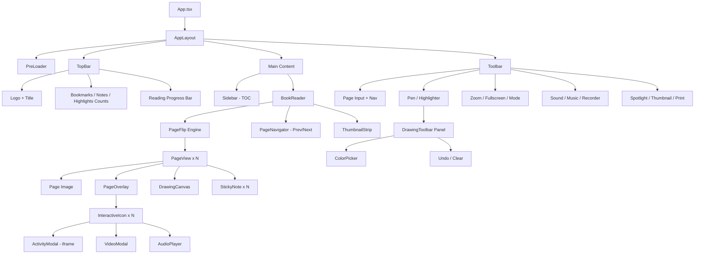

//to do-
tracker bar,
acessibility bar,
ui
notes-
highlight and pen tool

# 🚀 React Migration Plan — Burlington E-Book Player

> **Goal**: Convert the Burlington HTML E-Book Player into a modern, bug-free, fully responsive React application with Tailwind CSS, preserving all existing features and adding new enhancements.

---

## 📋 Table of Contents

1. [Tech Stack](#1-tech-stack)
2. [Project Structure](#2-project-structure)
3. [Phase 1 — Project Setup](#phase-1--project-setup)
4. [Phase 2 — Core Layout & Navigation](#phase-2--core-layout--navigation)
5. [Phase 3 — Book Reader Engine](#phase-3--book-reader-engine)
6. [Phase 4 — Interactive Overlays & Activities](#phase-4--interactive-overlays--activities)
7. [Phase 5 — Annotation & Drawing Tools](#phase-5--annotation--drawing-tools)
8. [Phase 6 — Notes, Bookmarks & Highlights](#phase-6--notes-bookmarks--highlights)
9. [Phase 7 — Additional New Features](#phase-7--additional-new-features)
10. [Phase 8 — Responsive Design & Polish](#phase-8--responsive-design--polish)
11. [Phase 9 — Testing, Optimization & Deployment](#phase-9--testing-optimization--deployment)
12. [Bug Fixes from Original Project (Mapped)](#bug-fixes-from-original-project)
13. [Data Migration Strategy](#data-migration-strategy)
14. [Component Tree Diagram](#component-tree-diagram)

---

## 1. Tech Stack

| Category | Technology | Why |
|----------|-----------|-----|
| **Framework** | React 18+ (Vite) | Fast dev server, modern DX, tree-shaking |
| **Language** | TypeScript | Type safety, fewer runtime bugs |
| **Routing** | React Router v6 | SPA navigation, deep linking to pages |
| **Styling** | Tailwind CSS v3 | Utility-first, responsive, dark mode support |
| **State Management** | Zustand | Lightweight, no boilerplate, perfect for medium apps |
| **Page Flip** | `react-pageflip` (or custom CSS flip) | React-native page turning component |
| **Canvas/Drawing** | Fabric.js + `react-fabricjs` wrapper | Proven drawing library (same as original) |
| **Icons** | Lucide React | Modern, tree-shakable SVG icons |
| **Animations** | Framer Motion | Declarative animations, gestures, page transitions |
| **Media Player** | React Player / HTML5 `<video>` + `<audio>` | No legacy Flash deps (replaces SoundManager 2) |
| **Modals/Dialogs** | Radix UI (Dialog, Popover, Tooltip) | Accessible, unstyled headless components |
| **Toast/Notifications** | Sonner | Lightweight toast notifications |
| **Storage** | localStorage + custom hook | Same persistence, cleaner API |
| **PDF/Image Viewer** | Native `` with lazy loading | WebP page images, no heavy viewer needed |
| **Carousel** | Embla Carousel | Lightweight, extensible, React-friendly |
| **Color Picker** | `react-colorful` | Tiny, accessible color picker |
| **Audio Recording** | MediaRecorder API (native) | Browser-native, no library needed |
| **Keyboard Shortcuts** | `react-hotkeys-hook` | Declarative keyboard shortcut handling |
| **Build** | Vite | Lightning-fast HMR, optimized production builds |
| **Linting** | ESLint + Prettier | Code quality |
| **Testing** | Vitest + React Testing Library | Unit + integration tests |

---

## 2. Project Structure

```
burlington-ebook-reader/
├── public/
│   ├── resources/
│   │   ├── book/                    # Page images (page_1.webp ... page_108.webp)
│   │   ├── Interactivities/         # Activity HTML files (embedded via iframe)
│   │   └── Animations/              # Video files
│   ├── audio/
│   │   ├── background_music.mp3
│   │   └── pageflip.mp3
│   └── favicon.ico
│
├── src/
│   ├── main.tsx                     # Entry point
│   ├── App.tsx                      # Root component + Router
│   ├── index.css                    # Tailwind imports + global styles
│   │
│   ├── config/
│   │   ├── book.config.ts           # Book metadata (title, pages, dimensions)
│   │   ├── toc.config.ts            # Table of contents data
│   │   └── pages.config.ts          # Interactive element positions per page
│   │
│   ├── types/
│   │   ├── book.types.ts            # Book, Page, TOCEntry, InteractiveItem
│   │   ├── notes.types.ts           # Note, Bookmark
│   │   └── drawing.types.ts         # DrawingTool, CanvasState
│   │
│   ├── store/
│   │   ├── useBookStore.ts          # Current page, view mode, zoom level
│   │   ├── useNotesStore.ts         # Notes CRUD, persistence
│   │   ├── useBookmarkStore.ts      # Bookmarks CRUD, persistence
│   │   ├── useDrawingStore.ts       # Drawing tool state, canvas data
│   │   ├── useSettingsStore.ts      # Sound, theme, preferences
│   │   └── useUIStore.ts            # Sidebar, modals, panels open/close
│   │
│   ├── hooks/
│   │   ├── useLocalStorage.ts       # Generic localStorage hook
│   │   ├── useFullscreen.ts         # Fullscreen API hook
│   │   ├── useKeyboardShortcuts.ts  # Keyboard navigation
│   │   ├── useAudioRecorder.ts      # MediaRecorder hook
│   │   ├── usePageFlipSound.ts      # Page flip sound effect
│   │   ├── useResponsive.ts         # Breakpoint detection
│   │   └── useClickOutside.ts       # Close panels on outside click
│   │
│   ├── components/
│   │   ├── layout/
│   │   │   ├── AppLayout.tsx        # Main layout wrapper
│   │   │   ├── TopBar.tsx           # Header with logo, title, counters
│   │   │   ├── Sidebar.tsx          # Table of contents sidebar
│   │   │   ├── Toolbar.tsx          # Bottom toolbar with all tools
│   │   │   ├── MobileToolbar.tsx    # Simplified toolbar for mobile
│   │   │   └── PreLoader.tsx        # Splash screen / loading
│   │   │
│   │   ├── reader/
│   │   │   ├── BookReader.tsx        # Main book container
│   │   │   ├── PageView.tsx          # Single page renderer
│   │   │   ├── PageFlip.tsx          # Page flip wrapper (react-pageflip)
│   │   │   ├── PageOverlay.tsx       # Interactive icons on a page
│   │   │   ├── PageNavigator.tsx     # Prev/Next buttons
│   │   │   ├── PageInput.tsx         # "Go to page" input
│   │   │   ├── ThumbnailStrip.tsx    # Bottom thumbnail carousel
│   │   │   └── PagePreviewModal.tsx  # Click-to-zoom page modal
│   │   │
│   │   ├── interactive/
│   │   │   ├── ActivityModal.tsx      # iframe activity modal
│   │   │   ├── VideoModal.tsx         # Video playback modal
│   │   │   ├── AudioPlayer.tsx        # Inline audio player
│   │   │   └── InteractiveIcon.tsx    # Clickable icon on page
│   │   │
│   │   ├── annotations/
│   │   │   ├── DrawingCanvas.tsx      # Fabric.js drawing overlay
│   │   │   ├── DrawingToolbar.tsx     # Pen, highlighter, eraser, colors
│   │   │   ├── ColorPicker.tsx        # Color selection for drawing
│   │   │   └── CanvasControls.tsx     # Undo, clear, save
│   │   │
│   │   ├── notes/
│   │   │   ├── NotesList.tsx          # Notes panel / dropdown
│   │   │   ├── NoteEditor.tsx         # Add/edit note modal
│   │   │   ├── NotePreview.tsx        # View/delete note modal
│   │   │   ├── StickyNote.tsx         # Draggable note icon on page
│   │   │   └── NotesCount.tsx         # Badge with count
│   │   │
│   │   ├── bookmarks/
│   │   │   ├── BookmarkList.tsx       # Bookmarks dropdown
│   │   │   ├── BookmarkButton.tsx     # Add/remove bookmark
│   │   │   └── BookmarkCount.tsx      # Badge with count
│   │   │
│   │   ├── highlights/
│   │   │   ├── HighlightsList.tsx     # Highlights panel
│   │   │   └── HighlightCount.tsx     # Badge with count
│   │   │
│   │   ├── tools/
│   │   │   ├── ZoomControls.tsx       # Zoom in/out/fit
│   │   │   ├── FullscreenToggle.tsx   # Fullscreen enter/exit
│   │   │   ├── ViewModeToggle.tsx     # Single/double page mode
│   │   │   ├── SpotlightTool.tsx      # Spotlight overlay
│   │   │   ├── SoundToggle.tsx        # Page-flip sound on/off
│   │   │   ├── BookOnlyToggle.tsx     # Hide UI for reading
│   │   │   └── PrintDialog.tsx        # Print options dialog
│   │   │
│   │   ├── audio/
│   │   │   ├── BackgroundMusic.tsx    # BG music player (hidden)
│   │   │   ├── AudioRecorder.tsx      # Voice recording panel
│   │   │   └── RecordingsList.tsx     # Saved recordings list
│   │   │
│   │   └── ui/
│   │       ├── Button.tsx             # Reusable button
│   │       ├── Modal.tsx              # Reusable modal (Radix)
│   │       ├── Tooltip.tsx            # Reusable tooltip (Radix)
│   │       ├── Badge.tsx              # Count badge
│   │       ├── Dropdown.tsx           # Dropdown menu
│   │       └── Sheet.tsx              # Side panel (mobile sidebar)
│   │
│   └── utils/
│       ├── storage.ts               # localStorage helpers
│       ├── pageCalculations.ts      # Page number conversions
│       ├── aspectRatio.ts           # Aspect ratio calculations
│       └── constants.ts             # App-wide constants
│
├── tailwind.config.ts
├── postcss.config.js
├── vite.config.ts
├── tsconfig.json
├── package.json
└── README.md
```

---

## Phase 1 — Project Setup

> **Goal**: Scaffold the React + Vite + TypeScript + Tailwind project and establish the foundation.

### Steps

1.  **Initialize Vite project**
    ```bash
    npx -y create-vite@latest ./ --template react-ts
    ```

2.  **Install core dependencies**
    ```bash
    npm install react-router-dom zustand framer-motion lucide-react
    npm install @radix-ui/react-dialog @radix-ui/react-tooltip @radix-ui/react-popover
    npm install embla-carousel-react react-colorful react-hotkeys-hook sonner
    npm install -D tailwindcss @tailwindcss/vite
    ```

3.  **Configure Tailwind** (`tailwind.config.ts`)
    ```ts
    export default {
      content: ["./index.html", "./src/**/*.{js,ts,jsx,tsx}"],
      darkMode: "class",
      theme: {
        extend: {
          colors: {
            brand: {
              50: "#eef6ff",
              100: "#d9eaff",
              500: "#3369a9",
              600: "#2a5a96",
              700: "#1e4a7d",
              800: "#153a64",
              900: "#0d2a4b",
            },
          },
          fontFamily: {
            sans: ["Inter", "system-ui", "sans-serif"],
          },
          animation: {
            "slide-in-left": "slideInLeft 0.3s ease-out",
            "slide-in-right": "slideInRight 0.3s ease-out",
            "fade-in": "fadeIn 0.2s ease-out",
            "bounce-in": "bounceIn 0.4s ease-out",
          },
        },
      },
      plugins: [],
    };
    ```

4.  **Set up folder structure** as per [Section 2](#2-project-structure)

5.  **Migrate static assets**
    -   Copy `resources/book/` → `public/resources/book/`
    -   Copy `resources/Interactivities/` → `public/resources/Interactivities/`
    -   Copy `audio/` → `public/audio/`
    -   Copy icon SVGs and logos → `public/img/`

6.  **Create type definitions** (`src/types/`)
    ```ts
    // book.types.ts
    export interface BookConfig {
      subject: string;
      class: string;
      id: string;
      totalPages: number;
      bookWidth: number;
      bookHeight: number;
      pageExt: "webp" | "png" | "jpg";
    }

    export interface TOCEntry {
      title: string;
      page: number;
      unit?: number;
    }

    export interface InteractiveItem {
      x: string;         // percentage from left
      y: string;         // percentage from top
      width?: string;
      height?: string;
      title: string;
      icon: string;
      link: string;
      type: "iframe" | "video" | "audio";
      size: string;      // "1024x720"
    }

    export type PageLinks = Record<string, InteractiveItem[]>;
    ```

7.  **Migrate config data** (clean version from `config.js` and `page.js`)
    -   Fix garbled TOC entries (`"GGrraaddee"`, `"iinndddd"`, page `1100`)
    -   Fix orphaned titles (`: Articles`, `: Pronouns` → proper titles)
    -   Fix Page 30 linking to `Page_31_1` → `Page_30_1`
    -   Validate all page numbers ≤ `totalPages`

### Deliverables
-   [ ] Vite + React + TS project running with `npm run dev`
-   [ ] Tailwind CSS configured and working
-   [ ] Folder structure created
-   [ ] All types defined
-   [ ] Config data migrated and cleaned
-   [ ] Static assets copied to `/public`

---

## Phase 2 — Core Layout & Navigation

> **Goal**: Build the main application shell — header, sidebar, toolbar, and routing.

### Components to Build

#### 2.1 `AppLayout.tsx`
-   Full-height flex layout: TopBar → Content → Toolbar
-   Responsive: stacks vertically on mobile
-   Supports "Book Only" mode (hides TopBar + Toolbar)
-   Framer Motion page transitions

#### 2.2 `TopBar.tsx`
-   Logo + Book title (from config)
-   Bookmark, Highlights, Notes counters with dropdown panels
-   Responsive: condenses to icon-only on small screens
-   Tailwind classes: `fixed top-0 w-full z-50 bg-white shadow-md`

#### 2.3 `Sidebar.tsx`
-   Table of Contents list from `toc.config.ts`
-   Click entry → navigate to that page
-   Current page highlighted
-   Mobile: renders as a slide-in `Sheet` panel
-   Desktop: collapsible side panel
-   Framer Motion slide transition

#### 2.4 `Toolbar.tsx`
-   Bottom toolbar with all action buttons:
    -   Sidebar toggle, Page input, Add Note, Zoom In/Out
    -   View Mode toggle (single/double), Fullscreen
    -   Book Only mode, Spotlight, Sound toggle
    -   Pen tool, Highlighter tool, Thumbnails
-   Responsive grid layout
-   Active state styling with Tailwind `ring` utilities
-   Mobile: shows condensed version (`MobileToolbar.tsx` with overflow menu)

#### 2.5 `PreLoader.tsx`
-   Animated splash screen with logo
-   Fades out after assets load (or 2s timeout)
-   Framer Motion `AnimatePresence` + `exit` animation

### State: `useUIStore.ts`
```ts
interface UIState {
  isSidebarOpen: boolean;
  isToolbarVisible: boolean;
  isBookOnlyMode: boolean;
  isPreloaderVisible: boolean;
  activeModal: "note" | "spotlight" | "activity" | "video" | "print" | null;
  toggleSidebar: () => void;
  toggleBookOnly: () => void;
  setActiveModal: (modal: UIState["activeModal"]) => void;
}
```

### Deliverables
-   [ ] AppLayout with TopBar, Sidebar, Toolbar
-   [ ] Sidebar with TOC navigation
-   [ ] Responsive layout (mobile/tablet/desktop)
-   [ ] PreLoader component
-   [ ] UI store working

---

## Phase 3 — Book Reader Engine

> **Goal**: Implement the core page-flip book reading experience.

### Components to Build

#### 3.1 `BookReader.tsx`
-   Main container for the book
-   Manages book dimensions, zoom level, and view mode
-   Responsive: auto-calculates aspect-ratio fit
-   Replaces the old `resizeBook()` / `zoomBook()` functions
-   Uses `ResizeObserver` for responsive resizing (replacing `$(window).resize()`)

#### 3.2 `PageFlip.tsx`
-   Wraps `react-pageflip` library for realistic page turning
-   Props: `totalPages`, `currentPage`, `viewMode`, `onPageChange`
-   Single page mode and double (book spread) mode
-   Keyboard arrow key navigation via `react-hotkeys-hook`
-   Touch/swipe support for mobile

#### 3.3 `PageView.tsx`
-   Renders a single page:
    ```tsx
    <div className="relative w-full h-full">
      
      <PageOverlay pageNum={pageNum} />
      <DrawingCanvas pageNum={pageNum} />
    </div>
    ```
-   Lazy loads page images
-   Click on page opens `PagePreviewModal`

#### 3.4 `PageNavigator.tsx`
-   Previous / Next buttons (positioned on sides)
-   SVG arrow icons (Lucide)
-   Plays page-flip sound on turn (via `usePageFlipSound` hook)
-   Disabled at first/last page

#### 3.5 `PageInput.tsx`
-   "Go to page X / totalPages" input
-   Input validation (valid range only)
-   Enter key navigates
-   Shows error toast (Sonner) for invalid pages

#### 3.6 `ThumbnailStrip.tsx`
-   Bottom carousel of page thumbnails (Embla Carousel)
-   Click thumbnail → navigate to page
-   Highlights current page(s) with ring
-   Toggle visibility from toolbar
-   Responsive: fewer items on mobile

#### 3.7 `PagePreviewModal.tsx`
-   Click a page to see full-resolution preview
-   Pinch-to-zoom on mobile
-   Close on backdrop click or Escape key
-   Radix UI Dialog

### State: `useBookStore.ts`
```ts
interface BookState {
  currentPage: number;
  viewMode: "single" | "double";
  zoomLevel: number;            // 1 = fit, max 3
  totalPages: number;
  setPage: (page: number) => void;
  nextPage: () => void;
  prevPage: () => void;
  setViewMode: (mode: "single" | "double") => void;
  zoomIn: () => void;
  zoomOut: () => void;
  resetZoom: () => void;
}
```

### Keyboard Shortcuts
| Key | Action |
|-----|--------|
| `←` / `→` | Previous / Next page |
| `Home` / `End` | First / Last page |
| `+` / `-` | Zoom in / out |
| `0` | Reset zoom |
| `F` | Toggle fullscreen |
| `Escape` | Close modals / exit fullscreen |

### Deliverables
-   [ ] Page-flip book reader working
-   [ ] Single and double mode toggle
-   [ ] Page navigation (buttons, keyboard, input, thumbnails)
-   [ ] Zoom in/out/reset
-   [ ] Responsive sizing
-   [ ] Page flip sound on turn
-   [ ] Page preview modal

---

## Phase 4 — Interactive Overlays & Activities

> **Goal**: Place clickable interactive icons on pages and open activities/videos.

### Components to Build

#### 4.1 `PageOverlay.tsx`
-   Reads `pages.config.ts` for the current page number
-   Renders `InteractiveIcon` for each interactive element
-   Positions icons using percentage-based `left` / `top` (Tailwind `absolute`)
-   Scales correctly at all zoom levels

#### 4.2 `InteractiveIcon.tsx`
-   Clickable icon with tooltip showing the activity title
-   Different icons for `iframe`, `video`, `audio` types
-   Hover animation (pulse/scale) via Tailwind + Framer Motion
-   Click opens the appropriate modal

#### 4.3 `ActivityModal.tsx`
-   Full-screen or sized modal with an `<iframe>`
-   Loads interactive HTML activities
-   Close button + Escape key to close
-   Responsive: full-screen on mobile, sized on desktop
-   Radix UI Dialog

#### 4.4 `VideoModal.tsx`
-   Modal with HTML5 `<video>` player
-   Play/pause/seek controls
-   Auto-pause when modal closes
-   Supports MP4 format

#### 4.5 `AudioPlayer.tsx`
-   Inline play/pause button with progress indicator
-   Uses HTML5 `<audio>` element
-   Shows playing state animation
-   Stops when navigating away from page

### Deliverables
-   [ ] Interactive icons rendered on correct pages
-   [ ] Activity iframe modal working
-   [ ] Video playback modal working
-   [ ] Inline audio playback working
-   [ ] All positioning responsive

---

## Phase 5 — Annotation & Drawing Tools

> **Goal**: Implement the pen/highlighter drawing overlay system.

### Components to Build

#### 5.1 `DrawingCanvas.tsx`
-   Fabric.js canvas overlay on each visible page
-   Transparent by default, interactive when tool is active
-   Per-page canvas state persisted to localStorage
-   Loads saved drawings on page turn

#### 5.2 `DrawingToolbar.tsx`
-   Side panel with tools:
    -   🖊️ **Pen** — free-hand drawing
    -   🟨 **Highlighter** — semi-transparent rectangle
    -   ↩️ **Undo** — remove last object
    -   🗑️ **Clear** — clear all on current page
    -   🎨 **Color picker** (`react-colorful`)
    -   📄 **Page selector** — which page to draw on
-   Opens as sliding panel from the left
-   Framer Motion slide animation

#### 5.3 `ColorPicker.tsx`
-   Preset colors + custom color picker
-   Alpha/opacity support for highlighter

#### 5.4 `CanvasControls.tsx`
-   Undo button (removes last Fabric.js object)
-   Clear button (with confirmation dialog)
-   Save indicator

### State: `useDrawingStore.ts`
```ts
interface DrawingState {
  activeTool: "none" | "pen" | "highlighter";
  penColor: string;
  highlightColor: string;
  penWidth: number;
  isToolbarOpen: boolean;
  canvasData: Record<number, string>;  // pageNum → JSON
  setTool: (tool: DrawingState["activeTool"]) => void;
  saveCanvas: (pageNum: number, json: string) => void;
  clearCanvas: (pageNum: number) => void;
  toggleToolbar: () => void;
}
```

### Deliverables
-   [ ] Drawing canvas overlay on pages
-   [ ] Pen tool (free-hand)
-   [ ] Highlighter tool (rectangle)
-   [ ] Color picker with presets
-   [ ] Undo / Clear actions
-   [ ] Per-page persistence to localStorage
-   [ ] Drawing toolbar panel

---

## Phase 6 — Notes, Bookmarks & Highlights

> **Goal**: Full CRUD for notes and bookmarks with localStorage persistence.

### 6.1 Notes System

#### Components
-   **`NoteEditor.tsx`** — Modal with page selector + textarea to add a note
-   **`NotePreview.tsx`** — Modal to view, edit, or delete a note
-   **`NotesList.tsx`** — Dropdown panel listing all notes across pages
-   **`StickyNote.tsx`** — Draggable sticky-note icon on the page (using `react-draggable` or Framer Motion `drag`)
-   **`NotesCount.tsx`** — Badge showing total count

#### Store: `useNotesStore.ts`
```ts
interface Note {
  id: string;
  pageNum: number;
  text: string;
  posX: number;
  posY: number;
  createdAt: number;
  updatedAt: number;
}

interface NotesState {
  notes: Note[];
  addNote: (note: Omit<Note, "id" | "createdAt" | "updatedAt">) => void;
  updateNote: (id: string, updates: Partial<Note>) => void;
  deleteNote: (id: string) => void;
  getNotesForPage: (pageNum: number) => Note[];
  totalCount: number;
}
```

> [!IMPORTANT]
> **Bug fix from original**: `getNotes()` will always receive `pageNum` as a required argument — the original code called it without arguments in `updateNote()`, causing silent failures.

### 6.2 Bookmarks System

#### Components
-   **`BookmarkButton.tsx`** — Toggle bookmark on current page (ribbon icon)
-   **`BookmarkList.tsx`** — Dropdown of all bookmarks with page navigation
-   **`BookmarkCount.tsx`** — Badge showing total count

#### Store: `useBookmarkStore.ts`
```ts
interface BookmarkState {
  bookmarks: number[];          // Array of page numbers
  toggleBookmark: (page: number) => void;
  isBookmarked: (page: number) => boolean;
  totalCount: number;
}
```

### 6.3 Highlights Count

-   **`HighlightsList.tsx`** — Shows pages that have canvas drawings
-   **`HighlightCount.tsx`** — Badge with count of highlighted pages
-   Reads from `useDrawingStore.canvasData` to count pages with data

### Deliverables
-   [x] Add, edit, delete notes with modal
-   [x] Draggable sticky notes on pages
-   [x] Notes list dropdown with navigation
-   [x] Bookmark toggle, list, and navigation
-   [x] Highlight page count from canvas data
-   [x] All data persisted to localStorage
-   [x] Counts displayed as badges in TopBar

---

## Phase 7 — Additional New Features

> **Goal**: Enhance the app with new features not present in the original.

### 7.1 🌙 Dark Mode
-   Tailwind `dark:` variant throughout
-   Toggle in settings/toolbar
-   Persists to localStorage
-   Applies to all modals, panels, toolbar
-   Smooth transition via `transition-colors duration-300`

### 7.2 🔍 Full-Text Search (NEW)
-   Search bar in top bar
-   Searches through TOC entries
-   Highlights matching results
-   Click result → navigate to page
-   Debounced input with loading state

### 7.3 📱 Touch Gestures (NEW)
-   **Swipe left/right** to turn pages (mobile)
-   **Pinch to zoom** on page preview
-   **Long press** on page to add quick note
-   Implemented with Framer Motion `drag` and `useGesture`

### 7.4 ⌨️ Keyboard Shortcut Help (NEW)
-   `?` key opens shortcut cheat-sheet modal
-   Lists all available keyboard shortcuts
-   Categorized: Navigation, Tools, View, etc.

### 7.5 📊 Reading Progress (NEW)
-   Progress bar at the top showing % of book read
-   Tracks furthest page reached
-   Persisted to localStorage
-   Shows in TopBar with subtle gradient

### 7.6 🕐 Reading History / Last Page (NEW)
-   Auto-saves current page on close
-   On re-open, asks "Continue from page X?" with toast
-   Stores last 10 viewed pages

### 7.7 📤 Export Notes (NEW)
-   Export all notes as a downloadable text/markdown file
-   Button in Notes panel
-   Includes page numbers and timestamps

### 7.8 🎨 Theme Customization (NEW)
-   Choose accent color for the UI
-   Preset palettes: Blue (default), Green, Purple, Orange
-   Applied via CSS custom properties + Tailwind

### 7.9 ♿ Accessibility Improvements (NEW)
-   Full ARIA labels on all buttons and controls
-   Focus management for modals
-   High-contrast mode option
-   Screen reader announcements for page turns
-   Skip-to-content link
-   All Radix UI components are accessible by default

### 7.10 📌 Quick Bookmark (NEW)
-   Click the page corner to bookmark (visual "dog-ear" effect)
-   Animated fold with Framer Motion

### 7.11 🔄 Auto Single-Page on Mobile (NEW)
-   Automatically switches to single-page mode on screens < 768px
-   Shows double-page on tablets and desktops
-   Smooth transition

### Deliverables
-   [ ] Dark mode toggle
-   [ ] TOC search
-   [ ] Touch gestures
-   [ ] Keyboard shortcut help modal
-   [ ] Reading progress bar
-   [ ] Auto-resume last page
-   [ ] Export notes to file
-   [ ] Theme customization
-   [ ] Full accessibility
-   [ ] Quick bookmark corner
-   [ ] Auto single-page on mobile

---

## Phase 8 — Responsive Design & Polish

> **Goal**: Ensure the app works beautifully on all screen sizes.

### Breakpoint Strategy (Tailwind)

| Breakpoint | Width | Layout |
|-----------|-------|--------|
| `sm` | ≥ 640px | Mobile phone (single page, bottom toolbar) |
| `md` | ≥ 768px | Tablet portrait (single page, compact toolbar) |
| `lg` | ≥ 1024px | Tablet landscape / small laptop (double page) |
| `xl` | ≥ 1280px | Desktop (full toolbar, sidebar) |
| `2xl` | ≥ 1536px | Large monitor (extra spacing) |

### Mobile-Specific Adaptations
-   **Sidebar** → full-screen slide-in Sheet
-   **Toolbar** → condensed with "More" overflow menu
-   **Thumbnails** → 3 visible items
-   **Notes/Bookmarks** → full-screen panels instead of dropdowns
-   **Drawing tools** → bottom sheet instead of side panel
-   **Zoom** → pinch gesture replaces buttons
-   **Page navigation** → swipe gestures primary

### Design Polish Checklist
-   [x] Consistent spacing with Tailwind spacing scale
-   [x] Smooth transitions on all interactive elements (150-300ms)
-   [x] Loading skeletons for page images
-   [x] Error states with retry for failed image loads
-   [x] Empty states for notes/bookmarks ("No bookmarks yet")
-   [x] Micro-animations on button clicks (scale bounce)
-   [x] Glassmorphism effect on toolbar (`backdrop-blur-md bg-white/80`)
-   [x] Gradient backgrounds for headers
-   [x] Focus ring styling for keyboard navigation
-   [x] Hover effects on all interactive elements

### Deliverables
-   [x] Fully responsive at all 5 breakpoints
-   [x] Mobile-optimized interactions
-   [x] Loading states and skeletons
-   [x] Error handling and empty states
-   [x] Polished micro-animations

---

## Phase 9 — Testing, Optimization & Deployment

### 9.1 Testing
-   **Unit tests** (Vitest) for:
    -   All Zustand stores (state transitions)
    -   Utility functions (page calculations, storage)
    -   Custom hooks
-   **Component tests** (React Testing Library) for:
    -   Navigation (page turns, input)
    -   Notes CRUD
    -   Bookmark toggle
    -   Modal open/close
-   **E2E tests** (Playwright, optional) for:
    -   Full reading flow
    -   Drawing and annotation
    -   Activity loading

### 9.2 Performance Optimization
-   **Image lazy loading** with `loading="lazy"` + Intersection Observer
-   **Page prefetching** — preload next 2 page images
-   **Code splitting** with `React.lazy()` for:
    -   Drawing tools (Fabric.js is 250KB+)
    -   Audio recorder
    -   Activity modals
-   **Debounced zoom** to prevent rapid re-renders
-   **Memoized components** with `React.memo` for page list
-   **Virtualized thumbnail list** for 108+ pages

### 9.3 Build & Deploy
```bash
npm run build        # Production build
npm run preview      # Preview production build locally
```

-   Output: static files in `dist/`
-   Deploy to: Netlify / Vercel / any static host
-   Or serve directly as static HTML (same as original)

### Deliverables
-   [ ] Core unit tests passing
-   [ ] Component tests for key flows
-   [ ] Lighthouse score > 90 (Performance, Accessibility)
-   [ ] Production build under 500KB (excluding assets)
-   [ ] Deployed and accessible

---

## Bug Fixes from Original Project

Every bug from the original analysis is addressed in this plan:

| # | Original Bug | How it's Fixed in React |
|---|-------------|------------------------|
| 1 | `<li>` inside `<button>` | Proper semantic HTML with Radix UI `DropdownMenu` |
| 2 | Malformed SVG attribute | All icons via Lucide React (no raw SVG) |
| 3 | Duplicate `$(document).ready()` | Single `useEffect` per component, no duplication |
| 4 | Invalid jQuery selector | No jQuery — TypeScript catches selector issues at compile time |
| 5 | Duplicate `const` declarations | Each module has its own scope — no collisions |
| 6 | Space key crashes without video | Keyboard handling via `react-hotkeys-hook` with guard checks |
| 7 | `toggleMusic()` commented but called | Properly implemented in `useSettingsStore` |
| 8 | Garbled TOC entries / page 1100 | Cleaned data in `toc.config.ts`, validated at build time |
| 9 | `getNotes()` called without args | TypeScript enforces required `pageNum` parameter |
| 10 | Page 30 links to Page_31_1 | Fixed in `pages.config.ts` |
| 11 | Duplicate `getBrowser()` | Not needed — React handles cross-browser compat |
| 12 | `$(this).remove()` in selectTool | Proper React state management, no DOM manipulation |
| 13 | `toggleMusic` in showAudioPanel | `useSettingsStore.toggleMusic()` always exists |
| 14 | jQuery version conflict potential | No jQuery at all |
| 15 | `<script>` after `</body>` | Single `main.tsx` entry point |
| 16 | No type-check on message data | TypeScript + type-safe message handlers |
| 17 | `#quizModal` not in DOM | `ActivityModal` component always mounted conditionally |
| 18-28 | Typos, dead code, style appending | TypeScript compilation, proper React patterns, Tailwind |

---

## Data Migration Strategy

### From `config.js` → `book.config.ts`
```ts
export const bookConfig: BookConfig = {
  subject: "Burlington English Everyday Grammar",
  class: "Class 6",
  id: "2caafbbe-41ae-411d-a4fe-35942aca42d9",
  totalPages: 108,
  bookWidth: 1305,
  bookHeight: 1710,
  pageExt: "webp",
};
```

### From `page.js` → `pages.config.ts`
```ts
export const pageLinks: PageLinks = {
  7: [
    {
      x: "54.1", y: "15",
      title: "Animation",
      icon: "video",        // Lucide icon name instead of path
      link: "resources/Animations/Page_7.mp4",
      type: "video",
      size: "1024x720",
    },
  ],
  // ... cleaned data for all pages
};
```

### localStorage Schema (same keys, better structure)
```
{prefix}_bookmarks     → number[]
{prefix}_notes_{page}  → Note[]
{prefix}_canvas_{page} → string (Fabric.js JSON)
{prefix}_audio_{page}  → Recording[]
{prefix}_settings      → SettingsState
{prefix}_last_page     → number
{prefix}_progress      → { furthestPage: number }
```

---

## Component Tree Diagram



---

## ⏱️ Estimated Timeline

| Phase | Description | Estimated Time |
|-------|------------|---------------|
| **Phase 1** | Project Setup | 1 day |
| **Phase 2** | Layout & Navigation | 2 days |
| **Phase 3** | Book Reader Engine | 3 days |
| **Phase 4** | Interactive Overlays | 2 days |
| **Phase 5** | Drawing Tools | 2-3 days |
| **Phase 6** | Notes & Bookmarks | 2 days |
| **Phase 7** | New Features | 3-4 days |
| **Phase 8** | Responsive & Polish | 2-3 days |
| **Phase 9** | Testing & Deploy | 2 days |
| **Total** | | **~18-22 days** |

---

> [!NOTE]
> This plan can be executed incrementally — each phase produces a working checkpoint. Phase 1-3 gives you a functional reader. Phase 4-6 adds all original features. Phase 7-9 adds enhancements and polish.

> [!TIP]
> Start with `npm create vite@latest ./ -- --template react-ts` and follow the phases in order. Each phase builds on the previous one.
